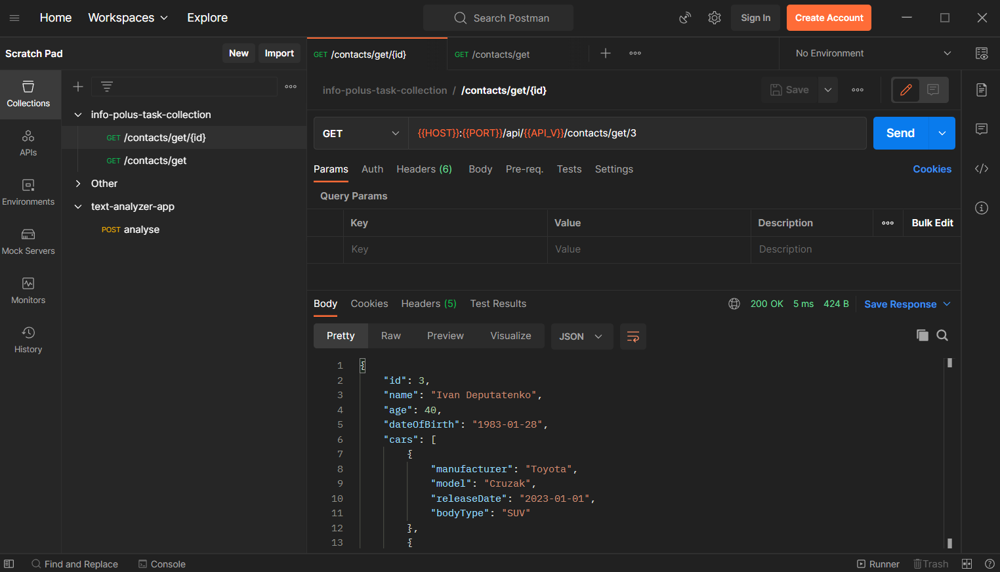

### ✅ ToDo

- [x] Implement Business Logic
- [ ] Implement Tests
- [x] Add Postman Collection
- [ ] Dockerise Application
- [ ] Fix README(links/etc.)

## Task Description
Напишите спринг сервис. Есть список контактов: Петров там, Иванов, Сидоров. 
Есть автомобили им принадлежащие. Жигули, Вольво, Ситроен и Хонда. Каждому какой-то, или два. 
Все равно кому как. Приложение должно отдавать эти персоны с принадлежащими им автомобилями. 
Гибернейт не нужен. В качестве хранилища, можно написать любой класс с хардкодом персон и авто.
додаткові коментарі:
( рест, и dto) ; интересует классический флоу

## How To Run And Test
1. Run `docker-compose up` in the project root dir
2. Import [Postman Collection](info-polus-task-collection.postman_collection.json)
3. Try to send requests(make sure to use variables provided by collection)

## Screenshots

